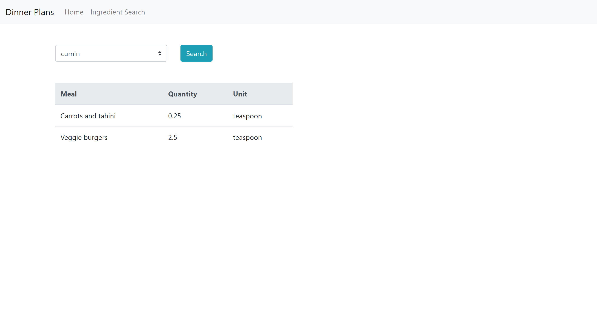

# grocery-list
## Info
This is a basic application that allows for the creation of a grocery list and then sending it to a google task list

## Why
My wife and wanted a quick way to create our grocery list instead of always going through recipe books

## How
1) Choose meals that you want to make for the week
2) Edit list based on ingredients that you already own or add ones not included in the recipes
3) Export list to a google task list

4) Use the ingredients tab to see meals that contain a specific ingredient

## Next
* Make javascript files typescript
* Add a real database instead of using the excel 
* Add unit testing!
* Create admin portal for adding new recipes

## Notes
Used this tutorial to get started: https://blog.miguelgrinberg.com/post/the-flask-mega-tutorial-part-i-hello-world

venv\Scripts\activate

flask run

Had to install googleapiclient as "pip install google-api-python-client"

Google task api reference: https://developers.google.com/tasks/v1/reference/

## Hosting on raspberry pi
need to make sure to update the apis so the point to prod server
make sure config file isnt tracked by git
flask db upgrade (to get insert the tables for the db)
run databaseSeed.sql to seed new values
flask run --host=0.0.0.0 (the 0.0.0.0 is important b/c that makes the server publicly available)

